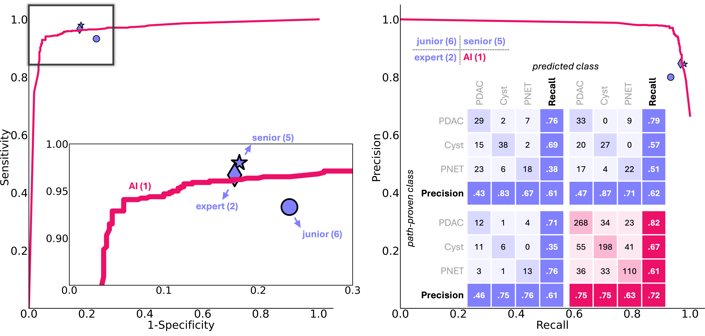

# ScaleMAI

 

## Paper

<b>ScaleMAI: Accelerating the Development of Trusted Datasets and AI Models</b>  
Wenxuan Li, Pedro R. A. S. Bassi, Tianyu Lin, Yu-Cheng Chou, Xinze Zhou, Yucheng Tang, Fabian Isensee, Kang Wang, Qi Chen, Xiaowei Xu, Xiaoxi Chen, Lizhou Wu, Qilong Wu, Yannick Kirchhoff, Maximilian Rokuss, Saikat Roy, Yuxuan Zhao, Dexin Yu, Kai Ding, Constantin Ulrich, Klaus Maier-Hein, Yang Yang, Alan L. Yuille, Zongwei Zhou  
Johns Hopkins University  
 

## *PancreaVerse:* An AI Trusted Dataset for Pancreatic Tumor Studies

 

AI models, trained on the PancreaVerse dataset, match senior and expert radiologists in tumor detection and surpasses them in tumor classification accuracy.

## Citation

## Acknowledgement

This work was supported by the Lustgarten Foundation for Pancreatic Cancer Research and the McGovern Foundation. Paper content is covered by patents pending.